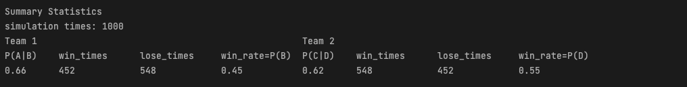

# IS597_Project_WBC_Simulation

## Team Member
Cindy Yang (tyy0309), Judy Chan (iamjudy)

## Background

Our project focuses on the 2023 World Baseball Classic (WBC) and aims to investigate the impact of **different competition formats** and **pitching roles** on game outcomes. The WBC has undergone significant changes in its tournament format over the past five editions. In 2006, the tournament featured round-robin group play in the first and second rounds, followed by single-elimination semifinals and finals. In 2009, the format was modified to a double-elimination system for the first two rounds (with the semifinals and final remaining single-elimination), which replaced the controversial round-robin format. In 2013, the tournament returned to a round-robin format for the first round, with the second round remaining double-elimination. In 2017, the format reverted to that of 2006, with both the first and second rounds being round-robin. For 2023, the tournament will feature a round-robin format in the first round, followed by single-elimination for the rest of the competition. By analyzing these various formats and the impact of pitching roles, we hope to gain insights into their effects on game results.

#### For the second experiment, we are using an existing package, double_elimination, which is provided in our references. Before running our program, please install with `pip install double_elimination` first.

## Experiment 1
### Hypothesis
The more pitches the starting pitcher throws, the higher the probability of winning.
  
### Assumptions
To simplify the simulation, we have made the following assumptions:

- In each game, each team will have three pitchers and nine batters on the field. There will be no player substitutions or adjustments during the game.
- The importance of a pitcher is determined by the number of pitches thrown, while all batters are considered equally important.
- The outcome of a game is solely determined by the combined performance of pitchers and batters, excluding external factors such as weather or home/away advantage.
- Player data is based on the 2023 WBC event, but this project only considers data from the top eight countries and excludes players who were registered but did not participate in at least one game.

  
### Phase 1 - Design
We have decided on the following formulas to determine the team's performance:

$$\text{Total Performance}= \text{Total Pitching Score} + \text{Total Hitting Score}$$

> **Note**: Since each statistic can have different scales and interpretations (higher values may represent better performance for some indicators and worse performance for others), we will use normalization in our code to process these values. We will transform each score into a range between 0~1

**Random Variables**:
1. At the beginning of each game simulation, players are selected at random as follows：
    - Randomly select 3 pitchers from `data/pitchers.csv`
    - Randomly select 9 batters from `data/batters.csv`

2.  Generating Normally Distributed Simulation Data Based on Season Performance
    
    Since we are referencing data from an entire season, but player performance should fluctuate, when selecting players, we will generate normally distributed game data based on the user input number of simulations, and ensure that the mean of these values matches the overall performance for the season 

    For example, if player A has a batting average of 0.3 for the entire season and 100 games are simulated, random values `x1` to `x100` of batting averages will be generated, following a normal distribution, and $$\frac{1}{100}\sum_{i=1}^{100}x_i = 0.3$$
    
    To make the random values generated for each game follow a normal distribution, in addition to the known season averages, we need to utilize the standard deviation of each indicator. We can choose appropriate standard deviations based on real-world data to reflect the performance fluctuations in actual games.

3. Randomly allocate the number of pitches for the three pitchers and use them as weights when calculating performance scores.
   
   $$\text{Pitching Score per pitcher}=(0.3 \times \text{ERA}) + (0.25 \times \text{WHIP}) + (0.15 \times \text{BAA}) + (0.1 \times \text{IP})+ (0.2 \times \text{K})$$

   $$\text{Total Pitching Score} = (\frac{\text{p1 pitch count}}{\text{total pitch count}}) \times \text{p1} + (\frac{\text{p2 pitch count}}{\text{total pitch count}}) \times \text{p2} + (\frac{\text{p3 pitch count}}{\text{total pitch count}}) \times \text{p3}$$

   And also, calculating hitting performance for 9 randomly selected batters:

   $$\text{Hitting Score per batter}=(0.25 \times \text{BA}) + (0.3 \times \text{OPS}) + (0.15 \times \text{RBI}) + (0.1 \times \text{BB})+ (0.1 \times \text{SO})+ (0.1 \times \text{SB})$$

   $$\text{Total Hitting Score}= \text{B1} + \text{B2} + \text{B3} + \text{B4} + \text{B5} + \text{B6} + \text{B7} + \text{B8} + \text{B9}$$

   For more information on the meaning behind these variables and how we choose the appropriate indicator, please refer to the `data/variables.txt` file.

  
### Phase 2 - Validation
**Comparing Simulation Results to 2023 WBC Rankings**:

We will compare our simulation results to the actual rankings of the 2023 WBC to see if they align with reality. The top eight teams in the competition are as follows:

1. Japan (JPN)
2. United States (USA)
3. Mexico (MEX)
4. Cuba (CUB)
5. Venezuela (VEN)
6. Puerto Rico (PUR)
7. Australia (AUS)
8. Italy (ITA)

By analyzing our simulation results, we can ensure that our model accurately predicts the performance of these teams.

### Phase 3 - Experiment
**Two teams with similar strengths**
  - By observing the conditional probability (i.e., the probability of Team A winning when their starting pitcher has a higher pitch count), it can be inferred that when the starting pitcher has a higher pitch count, the team is more likely to win.
  
    

    

**Two teams with a significant difference in strength**
  - When observing the conditional probability, it can be noticed that for the stronger team, the number of pitches thrown by the starting pitcher does not have a significant impact on the win rate. However, for the weaker team, a large proportion of their wins occur when their starting pitcher throws more pitches than the starting pitcher of the stronger team.
  
    

    

## Experiment 2
### Hypothesis
The round-robin format is more advantageous for teams with stable performance than the double-elimination format.
  
### Assumptions
- The simulation will focus on the quarterfinals and beyond to simplify the analysis. The finals will remain single-elimination.
- To generate WBC data, we will use MLB data, as it is more widely available online.
- The simulation will consider only average pitcher and batter performance, competition system, and pitching limitations, and exclude factors such as weather and home team advantage.
- Stable performance can be represented by the gaming result of 2023 WBC, i.e., Japan is the championship; hence, Japan has the most stable performance.
- If the points are tied in the round-robin, the ranking will be determined by the "run rate" (total runs allowed / total number of outs) among teams with the same record.

### Phase 1 - Design
We have decided to use the same formula in the experiment 1 to determine the team's performance:

$$\text{Total Performance}= \text{Total Pitching Score} + \text{Total Hitting Score}$$

**Random Variables**:
1. At the beginning of each game simulation, random batters and hitters are selected at in the same way of experiment 1.
2. Randomly generating pools for the first round of game simulation.
- Round-Robin Simulation: Generate 2 pools of four teams
- Double-Elimination Simulation: Generate 4 pools of two teams
> **Note**: To run double_elimination() function, you need to import Tournament first by running `pip install double_elimination`.  
3. For Round-Robin Simulation, there would be tiebreaker situations that would be determined by the "run rate".
However, `Total Runs Allowed` data is hard to find, so we randomized the value here.
$$\text{Run Rate}= \text{Total Runs Allowed} / \text{Total Number of Outs}$$

  
### Phase 2 - Validation

**Comparing Simulation Results to 2023 WBC Rankings**:

We will compare our simulation results to the actual rankings of the 2023 WBC to see if they align with reality. The top eight teams in the competition are as follows:

1. Japan (JPN)
2. United States (USA)
3. Mexico (MEX)
4. Cuba (CUB)
5. Venezuela (VEN)
6. Puerto Rico (PUR)
7. Australia (AUS)
8. Italy (ITA)

By analyzing our simulation results, we can ensure that our model accurately predicts the performance of these teams.

### Phase 3 - Experiment
**The results of 1000 simulations**
- By observing the probability of each country entering Semi-Final and Final, it can be inferred that round-robin and 
double-elimination does not differentiate the results a lot.

## References
  - World Baseball Classic data \
  https://www.mlb.com/world-baseball-classic/stats/team/runs
  - World Baseball Classic wikipedia \
  https://en.wikipedia.org/wiki/2023_World_Baseball_Classic
  - Round-Robin Tournament \
  https://en.wikipedia.org/wiki/Round-robin_tournament
  - Double-Elimination Tournament \
  https://en.wikipedia.org/wiki/Double-elimination_tournament \
  - Double-Elimination Package \
  https://github.com/smwa/double_elimination
  - Presentation template \
  https://slidesgo.com/theme/latin-baseball-team-project-proposal#search-Baseball&position-5&results-7
